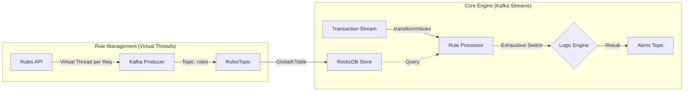

# Axiom-21: Modern Java Event-Driven Rule Engine


> **A masterclass in modern Java architecture, demonstrating the evolution from Java 8 Streams to Java 21 Data-Oriented Programming (DOP).**

Axiom-21 is a high-performance **Event-Driven Rule Engine** built on **Kafka Streams** and **Java 21**. It showcases elite patterns for Compile-Time Safety, RocksDB Performance Tuning, and Virtual Thread Concurrency.

---

## 🏗️ Architectural Blueprints

The system processes financial **Transactions** in real-time, evaluating them against a dynamic set of **Rules** using a state-store lookup strategy.



### Elite Technical Features

#### 1. Compile-Time Safety (The DOP Edge)

We leverage **Sealed Interfaces** and **Switch Expressions** to turn logic gaps into build failures.

- **Pattern**: `sealed interface Rule permits ...`
- **Safety**: The Java 21 compiler ensures _every_ rule type is handled in the `switch`. No `default` clause means no silent bugs.

#### 2. High-Performance State (RocksDB Tuning)

Kafka Streams uses RocksDB for state management. In containerized environments, default settings can cause OOM kills.

- **Solution**: Custom `RocksDBConfigSetter`.
- **Tuning**: Bounded Block Cache (e.g., 64MB), limited Write Buffers, and partitioned indexes for sub-millisecond lookups.

#### 3. Modern Concurrency (Project Loom)

The **Rules Manager** module uses **Virtual Threads** (`Executors.newVirtualThreadPerTaskExecutor()`) to handle rule injection. This allows the administrative layer to handle thousands of concurrent updates with minimal memory footprint compared to platform threads.

---

## 🚀 Technical Breakdown: The Evolution

### 1. The Legacy Era (Java 8)

_Package: `axiom-core-v8`_

- **Paradigm**: Imperative Object-Oriented.
- **Logic**: Mutable POJOs, `if-else` chains with `instanceof`, manual casting.

### 2. The Transitional Era (Java 17 LTS)

_Package: `axiom-core-v17`_

- **Paradigm**: Mixed OO and Functional.
- **Logic**: Records and Sealed Classes, but limited pattern matching capability.

### 3. The Modern Era (Java 21 LTS)

_Package: `axiom-core-v21`_

- **Paradigm**: Data-Oriented Programming (DOP).
- **Logic**:
  - **Transaction**: `record` (Immutable Data Carrier).
  - **Rule**: `sealed interface` (Restricted Hierarchy).
  - **Engine**: `switch(rule)` with **Record Patterns** deconstruction.
  - **Topology**: `transformValues` with direct State Store access for 1-to-All logic.

---

---

## 🚪 Entry & Exit Points

### Input (Entry)

1.  **Main Engine**: `com.axiom.v21.AxiomApplication`
    - _Role_: Starts the Kafka Streams topology.
    - _Topic Inputs_: `transactions`, `rules` (Compacted).
2.  **Rule Manager**: `com.axiom.rules.manager.VirtualThreadRuleManager`
    - _Role_: Injects new rules (Virtual Threads).

### Output (Exit)

1.  **Sink Topic**: `alerts`
    - _Content_: `EvaluationResult` records.
2.  **Observability**:
    - AKHQ UI: `http://localhost:8080`.
    - Logs: Console Output.

---

## 🛠️ Infrastructure & Setup

The project creates a complete local ecosystem using Docker Compose.

- **Kafka & Zookeeper**: Event backbone.
- **Schema Registry**: Contract management.
- **AKHQ**: Observability UI.

### Getting Started

1.  **Start Infrastructure**:
    ```bash
    docker-compose up -d
    ```
2.  **Build Project**:
    ```bash
    mvn clean install
    ```
3.  **Run Modern Engine**:
    ```bash
    java -jar axiom-core-v21/target/axiom-core-v21.jar
    ```

---

_Authored by Axiom-21 Engineering Team_
